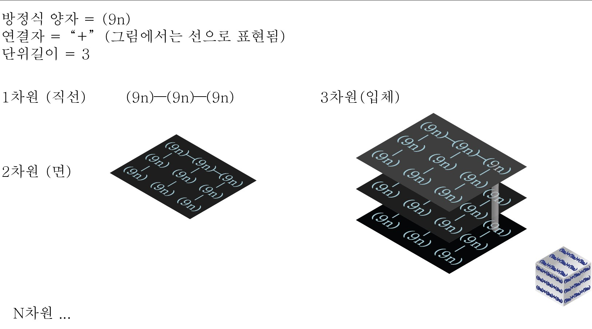
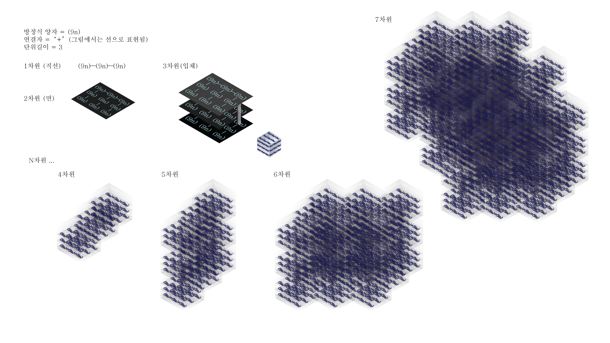

## Python으로 CPU멀티코어를 모두 사용하는 병렬 프로그렘을 구현해서 확실한 퍼포먼스 향상 경험해보기
> ## __프로젝트 구상 동기 
>  Python은 GIL로 인해 하나의 인터프리터가 여러 코드를 동시에 실행할 수 없습니다.
 때문에 비동기식 코드도 (상황에 따라서 다르지만) 완전한 병렬성을 살리기는 힘듭니다.   
 **책을 읽다가 concurrent.futures모듈의 ProcessPoolExcutor를 사용하면 쉽게 병렬 프로그레밍이 가능하다는걸 알게 되었습니다.**   
 ProcessPoolExcutor외에도 저수준의 multiprocessing모듈 등을 사용하면 병렬 프로그레밍이 가능하다고 합니다.
 CPU가 멀티쓰레드를 가질 때 메인 쓰레드가 자식 쓰레드에서 다른 Python인터프리터를 생성합니다.   
 자식쓰레드에게 Python객체를 (**바이너리로** 직렬화해서)보내고 결과를 (역직렬화 해서)돌려받습니다. (자식 쓰레드는 반대로 역직렬화-연산-직렬화를 거쳐 결과를 넘겨줍니다)   
 이때 데이터를 직렬화/역직렬화 하면서 로컬 소켓을 통해 통신하는 컨텍스트 스위치(문맥전환)비용이 발생합니다.    
 Python으로 병렬 프로그레밍을 꼭 해보고싶었기 때문에 실험을 위해서 병렬성이 확실한 퍼포먼스 차이를 가져다주는 프로그렘이 필요했습니다.   
 이를 위해서 N차원 수식객체를 구상하게 되었고 그것을 Python 프로그렘으로 구현해보기로 했습니다   

## N차원 수식객체에 대한 설명   
* ### 객체를 구성하는 속성   
    * 방정식 양자   
        * 최소 단위라는 의미에서 "양자"라는 표현을 사용하였습니다.   
        * 미지수 n을 가지는 방정식입니다.    
        * 얼마든지 복잡할 수 있습니다. _예시 : ((2n/n**-3)%n)**n   
    * 연결자   
        * 방정식 양자를 연결하는 연산자입니다.   
    * 단위길이   
        * 차원이 가지는 좌표 축들의 길이입니다.   
        * 단위 길이가 없으면 하나의 객체가 아닌 무한한 공간이 되기 때문에 연산이 불가능합니다 
    * N차원
        * 차원을 나타내는 숫자입니다.   
* ### 객체가 연산되는 원리   
    * 미지수 n 에 대입될 숫자를 입력받습니다.   
    * #### 연결자로 모든 방정식 양자를 연결시킨 뒤 연산합니다.   
        #### 아래와 같은 원리로 연결하며 연산 시에는 차원을 축소시키면서 결과에 도달하는 구조입니다
        * 0차원 = 방정식 양자
        * 1차원 = 0차원을 단위길이만큼 연결합니다.
        * 2차원 = 1차원을 단위길이만큼 연결합니다.
            * 연산: 3개의 가로줄이 1차원 연산을 진행한 뒤에 세로줄에서 결과가 합쳐지는 모양입니다.
        * 3차원 = 2차원을 단위길이만큼 연결합니다.
            * 연산: 2차원 연산을 마친 값들이 Z축(높이)를 따라서 합쳐지는 모양입니다.
        * N차원 ...
    * 모든 방정식 양자가 소비되서 하나의 값으로 통합될 때까지 연산합니다.
---

## N차원 수식객체가 차원에 따라서 어떤 모양을 하는지 시각화한 그래픽   
> 차원을 제외한 나머지 속성들을 (방정식 양자: 9, 연결자: + , 단위길이 3)으로 고정하였습니다

## 그래픽의 전체 모습을 담은 JPG파일입니다.

_그래픽은 Adobe Illustrator로 제작했습니다_

> ## main.py를 사용해서 병렬 프로세싱으로 향상된 처리 속도 확인하기 (예시)
>``` 
>PS C:\Users\USER\desktop\MultiprocessingDimensionalFormula> python main.py
>---N차원 수식 객체를 생성합니다.---
>방정식 양자를 입력해주세요 - 객체를 구성하는 최소단위 입니다. 예시) '3n/7+n**2'
>        _:-11n**(n-(n/8))/3
>단위 길이를 입력해주세요 - 1차원 직선상에 놓이는 방정식 양자의 갯수입니다.
>       (단위 길이가 없으면 하나의 객체가 아닌 무한한 공간이 되기 때문에 연산이 불가능합니다)
>       _:3
>방정식 양자들끼리 연결시키는 연산자를 입력해주세요.
        >[ + , - , / , * , ** , // , % , ... ] 모두 사용 가능합니다.
>       _:+
>객체의 차원을 입력해주세요.
        >차원인자는 연산량에 엄청난 차이를 가져옵니다.
>       _:7
>연산을 진행하기 위해서 입력한 방정식 "-11n**(n-(n/8))/3"의 미지수 n을 입력해주세요.   
>       _:31
>
>
>
>직렬로 연산을 진행합니다 Yes:그냥 엔터키 , 취소:아무 문자 입력 후 엔터
>시작 : 09:16:23
>메인 연산 진행합니다----
>연산결과 : -2.276701841014937e+44
>끝 : 09:16:28
>걸린시간 : 4.628
>
>
>병렬로 연산을 진행합니다 Yes:그냥 엔터키 , 취소:아무 문자 입력 후 엔터
>시작 : 09:16:34
>메인 연산 진행합니다----
>메인 연산 진행합니다----
>메인 연산 진행합니다----
>메인 연산 진행합니다----
>메인 연산 진행합니다----
>메인 연산 진행합니다----
>연산결과 : -2.2767018410149646e+44
>끝 : 09:16:35
>걸린시간 : 0.803
>
>
>일반 직렬 연산 결과 : -2.276701841014937e+44 __ 병렬연산 결과 : -2.2767018410149646e+44
            >극도로 미세한 결과의 차이는 실수 자료형의 부동소수점 반올림 오차입니다. 무시합니다.
>
        >이 컴퓨터의 CPU코어수는 6개 입니다. 병렬 프로그레밍으로 최대 6배 빨라질 수 있음을 의미합니다.
        >연산에 사용된 방정식 양자의 갯수는 총 2187개 입니다.
>
        >병렬 연산 시에는 2187개의 방정식 양자를 6개의 CPU코어들에게 최대한 균등하게 할당합니다.
        >메인 쓰레드가 각 CPU들에게서 연산 결과를 (거의 동시에)전달받은 뒤에
        >그것들로 최종 결과를 연산하여 값을 반환합니다.
>
        >CPU 멀티코어를 사용해서 연산했을때 5.76배 더 빨랐습니다.
>```
> 필자의 컴퓨터는 "인텔® 코어™ i5-9400F 프로세서"로 코어 수 6개-스레드 수 6개 입니다.   
> 모든 코어를 활용해서 6배 가깝게 속도를 향상시킬수 있었습니다.   
> (이해하기 어렵지만 가끔 미세하게 6배 이상의 속도향상도 나오곤 합니다)
---
소스코드에 독스트링을 자세하게 작성하고 Type annotation를 사용해서 이해하기 쉽도록 하였습니다
